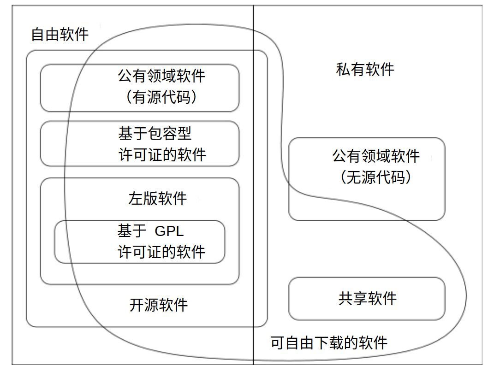

# 自由与非自由软件的分类

同时参考“需要避免使用（或者谨慎使用）的词语，由于它们是不公正的或者迷惑性的”一文。

> 本图最初由 Chao-Kuei 创作并且经过其他若干人的更新，解释了不同类别的软件。现有它的矢量图版本，位于<https://gnu.org/philosophy/category.svg>以及 XFig 文档版本，位于<https://gnu.org/philosophy/category.fig>。本图采用 GNU 通用公共许可证（GNU GPL）2.0 或更高版本、GNU 自由文档许可证（GNU FDL）1.2 或更高版本、或者知识共享：署名——相同方式共享（CC BY-SA）许可证 2.0 或更高版本。

## 自由软件（Free Software）

自由软件是附带这样的许可的软件，它允许任何人使用、复制和/或再分发，不论是逐字再分发还是再分发带有更改的版本，也不论免费还是有偿。特别地，这意味着源代码必须可获得。“如果它不是源代码，它就不是软件。”这是一种简化的描述；您可以在“什么是自由软件”一文中找到完整的定义。

如果一个程序是自由的，那么它可以潜在地被包含在自由的操作系统之中，例如 GNU，或者 GNU/Linux 操作系统的自由版本。[^1]

有很多种不同的方式可以使程序成为自由的——很多细节的问题，可以有多种方式对它们做出决定，而仍然能够使程序成为自由的。一些可能的变体将会在下文进行描述。如需获得关于特定的自由软件许可证的信息，参见许可证列表页面，位于<https://gnu.org/licenses/license-list.html>。

自由软件关乎自由而非价格。但是私有软件公司一般使用“free software”这一短语来指代价格。有时他们的意思是您可以免费获得一份二进制副本；有时他们的意思是在您所购买的计算机上捆绑了一份副本，而它的价格包含了二者各自的价格。不管是哪种方式，这都与我们在 GNU 计划中所指的自由软件无关。

由于这种潜在的混淆，当一家软件公司宣称它的产品是“free software”的时候，务必查看实际的分发条款以确认用户是否真正拥有自由软件所暗示的所有自由。有时它真的属于自由软件，有时则不是。

很多语言都拥有两个独立的单词用来表示“freedom”中的自由和“零价格”中的免费。例如，法语拥有“libre”和“gratuit”。而英语则不是；在英语中确实有一个单词“gratis”用于无歧义地表示价格，但没有普通的形容词用于无歧义地表示自由。因此，如果您说另一种语言，我们建议您在将“free”翻译为您的母语的时候澄清其涵义。参见我们整理的将“free software”这一短语翻译为其他多种语言的详细列表。

自由软件通常比非自由软件更加可靠。[^2]

## 开源软件（Open Source Software）

“开源软件”这一短语被某些人用于指代与自由软件或多或少地相同的一类软件。它们并不是与自由软件准确相同的一类软件：它们接受某些在我们看来约束性过强的许可证，也有它们所拒绝接受的自由软件许可证。然而，自由软件与这一延伸类别之间的差别并不大：几乎所有的自由软件也符合开源软件定义，并且几乎所有的开源软件也是自由的。

我们倾向于使用“自由软件”这一词语，由于它代表自由——这是“开源”这一短语所不能体现的。[^3]

## 公有领域软件（Public Domain Software）

公有领域软件是指不受版权约束的软件。如果源代码也在公有领域中，则是一种非左版自由软件的特例，这意味着某些副本或者修改版本可能完全不是自由的。

在某些情况下，可执行程序可能位于公有领域之中，但是源代码不可获得。这不是自由软件，由于自由软件要求源代码的可获得性。与此同时，大部分自由软件不在公有领域中，它们是受版权约束的，并且版权持有人通过使用自由软件许可证合法地赋予任何人使用它们的自由许可。

有时，人们会以一种不严格的方式使用“公有领域”这一词语来指代“自由”或者“可免费获得”。然而，“公有领域”是一个法律概念，准确表示“不受版权约束”之意。为了澄清，我们建议将“公有领域”仅仅用于这一涵义，而使用其他短语来指代其他涵义。

根据大多数国家已经签署的伯尔尼保护文学和艺术作品公约，任何写下的东西自动获得版权，这也包括计算机程序。因此，如果您想要使得您所编写的程序进入公有领域，您必须采取某些法律步骤以否认其版权；否则该程序是受版权约束的。

## 左版软件（Copylefted Software）

左版软件是一类自由软件，其分发条款保证它的所有版本的所有副本都带有或多或少地相同的分发条款。例如，这意味着左版许可证普遍禁止他人为该软件添加额外的要求（尽管一系列有限的、安全添加的要求可能被允许），并且要求源代码可获得。这可以保护该程序及其修改版本，使得某些常见的方式不能将其变为私有的。

一些左版许可证例如 GNU 通用公共许可证（GPL）版本 3 阻止了其他一些使软件变为私有的方式，例如 Tivo 化（tivoization）。[^4]

在 GNU 计划中，我们为自己编写的几乎所有软件使用了左版许可证，由于我们的目标是赋予**每一位**用户“自由软件”这一词语所暗示的自由。参见我们关于左版的文章“什么是左版”以获得关于左版许可证如何发挥作用以及我们为何使用它们的更多解释。

左版是一个通用的概念；为了以左版许可证分发一个实际存在的程序，您需要使用特定的一系列分发条款。有多种可能的方式编写左版分发条款，因此原则上可以有很多种左版自由软件许可证。然而实际上几乎所有左版软件都使用 GNU GPL。两种不同的左版许可证通常“不兼容”，这意味着直接合并使用一种许可证的代码与使用另一种许可证的代码是非法的；因此，人们使用同一种左版许可证将会有利于社区。

## 非左版的自由软件（Noncopylefted Free Software）

非左版的自由软件带有来自作者的再分发和修改的许可，以及添加额外限制条款的许可。

如果一个程序是自由的但是并未采用左版许可证，那么某些副本或者修改版本可能完全不是自由的。软件公司可以编译该程序，不论是否对其进行修改，并且将其可执行文件作为私有软件产品分发。

X Window System 解释了这一点。X 联盟将 X11 以某种分发条款发布，使其成为非左版的自由软件，并且后续的开发者几乎沿用了相同的实践。一份带有此类分发条款的副本是自由软件。然而，也有非自由版本的存在，并且确实有（或者至少确实曾经有）用于工作站或者个人计算机（PC）的流行的图形板卡仅可支持非自由版本。如果您使用的是这类硬件，那么 X11 对您来说不是自由软件。X11 的开发者甚至曾经在一段时期将 X11 作为非自由软件[^5]；他们之所以能够如此做，是由于其他人使用相同的非左版许可证贡献了他们的代码。

## 使用包容型许可证的软件（Lax Permissive Licensed Software）

包容型许可证包括 X11 许可证和两种 BSD 许可证。[^6]这些许可证几乎允许以任何方式使用其代码，包括分发私有的二进制版本，不论是否更改了源代码。

## GPL 覆盖的软件（GPL-Covered Software）

GNU GPL 是一类特定的分发条款集合，用于使程序成为左版的。GNU 计划将其用作大部分 GNU 软件的分发条款。

因此，将自由软件等同于 GPL 覆盖的软件是一种错误。

## GNU 操作系统（The GNU Operating System）

GNU 操作系统是一种完全由自由软件构成的类 Unix 操作系统，我们于 1984 年开始在 GNU 计划中对其进行开发。[^7]

类 Unix 操作系统由众多程序构成。GNU 操作系统包括所有官方的 GNU 软件包。它还包括众多其他软件包，诸如 X Window System 以及 TeX，它们不是 GNU 软件。

完整的 GNU 操作系统的首个测试版于 1996 年发布，它包括 GNU Hurd，我们的内核，后者于 1990 年开始开发。直到 2001 年，GNU 操作系统（包括 GNU Hurd）开始能够相对可靠地运行，但是 Hurd 仍然缺少某些重要特性，因此它并未被广泛使用。与此同时，GNU/Linux 操作系统，作为使用 Linux 而非 GNU Hurd 作为内核的 GNU 操作系统的衍生版本，自 20 世纪 90 年代起已经获得了巨大成功。[^8]这表明了 GNU 操作系统不是一个静态的程序集合；用户和分发者可以根据他们的需求和偏好来选择不同的软件包。其结果仍是一种 GNU 操作系统的变体。

由于 GNU 操作系统的目标是自由，GNU 操作系统中的任何一个组件都是自由软件。但是，它们不必须都是左版的；任何类别的自由软件都是合法地适用，如果它有助于实现技术上的目标。

## GNU 程序（GNU Programs）

“GNU 程序”是 GNU 软件的同义词。如果 foo 是一个 GNU 软件，那么它也是一个 GNU 程序。我们有时也称之为“GNU 包”。

## GNU 软件（GNU Software）

“GNU 软件”是指在 GNU 计划支持下发布的软件。[^9]如果一个程序是 GNU 软件，我们也可称之为 GNU 程序或 GNU 包。GNU 包的自述文件或手册应当声明它是一个 GNU 包；同时，自由软件目录[^10]标识了所有 GNU 包。

大部分 GNU 软件是左版的，但不是全部；然而，所有 GNU 软件都必须是自由软件。

有些 GNU 软件是由自由软件基金会（FSF）员工所编写的，但是大部分 GNU 软件来自众多志愿者。[^11]（某些志愿者由商业公司或者大学支付薪酬，但他们是我们的志愿者。）某些贡献的软件由 FSF 拥有版权；有些由编写它们的贡献者拥有版权。

## FSF 拥有版权的 GNU 软件（FSF-Copyrighted GNU Software）

GNU 包的开发者可以选择将版权移交给 FSF 或者自己保留。这是他们的选择权利。

如果他们将版权移交给 FSF，该程序成为 FSF 拥有版权的 GNU 软件，此时 FSF 可以实行它的许可证执法。如果他们选择自己保留版权，实行许可证执法是他们自己的责任。

FSF 不会接受不属于官方 GNU 包的软件的版权协议，这是一条规定。

## 非自由软件（Nonfree Software）

非自由软件是指任何不是自由软件的软件。它的使用、再分发或修改被禁止，或者要求您请求授权许可，或者被如此严格地限制，以至于您在事实上不可能自由地进行以上行为。

## 私有软件（Proprietary Software）

私有软件是非自由软件的另一种叫法。在过去，我们曾经将非自由软件进一步细分为“半自由软件”（semifree software），它们允许非商业性的修改和再分发；以及“私有软件”，它们禁止此类修改或者再分发。但我们现在已经放弃了这种区分，并且将“私有软件”用作非自由软件的同义词。

FSF 遵循这样的规则，我们不能在自己的计算机上安装任何私有软件，除非暂时性地用于一种特殊目的，即为其编写一个自由的替代品。除此之外，我们感觉没有任何可能的借口来安装一款私有软件。

例如，在 20 世纪 80 年代，我们认为在我们的计算机上安装 Unix 是合理的，由于我们需要用它编写一个可以取代 Unix 的自由操作系统。而现在，由于自由的操作系统已经有了，因此这一借口不再适用；我们不会使用任何私有操作系统，并且我们所部署的任何一台新计算机都必须运行一款完全自由的操作系统。

我们并不坚持要求 GNU 的用户或者贡献者也必须严格遵守这条规则。它只是我们对自己制定的规则。但我们希望您也会遵循它，为了您的自由。

## 免费软件（Freeware）

“Freeware”这一短语没有明确并且公认的定义，但它通常被用于指代那些允许再分发但禁止修改（并且其源代码不可获得）的软件包。这些软件包**不是**自由软件，因此请不要使用“freeware”来指代自由软件。

## 共享软件（Shareware）

共享软件是指那些附带有允许人们再分发其副本的许可协议的软件，但它宣称任何人如果想要继续使用其一份副本就**必须**支付一笔授权许可费用。

共享软件不是自由软件，甚至不是半自由软件。有两大原因：

* 对于大多数共享软件，源代码不可获得；因此，您完全不能修改它们；
* 共享软件并不带有允许人们在不支付授权许可费用的条件下复制并且安装它们的许可，甚至对于那些从事非赢利性的活动的个人用户也不提供这样的许可。（实际上，人们经常不遵守这种分发条款并且仍然这样做，但是许可条款并不允许如此做。）

## 私人软件（Private Software）

私人软件或者定制软件是指专为某一特定用户（通常是一家组织机构或者商业公司）开发的软件。该用户保存和使用它，并且不会以源代码或者二进制格式将其对公众发布。

私人软件可以是自由软件（尽管是在一种较为平凡的意义上），如果它的终极用户拥有四项基本自由。特别地，如果其用户对私人软件拥有完整的权利，该软件就是自由的。然而，如果用户向其他人分发副本但不随之提供四项基本自由，那些副本就不是自由软件。

自由软件关乎自由，而非可获得性。总的来说，我们不认为开发一款软件但却不发布它是在做坏事。确实有这样的情况，一款软件举足轻重，以至于人们可以争论，独占这款软件而拒绝对公众发布是在对全人类犯罪。然而，这样的情况毕竟罕见。大部分软件并非如此生死攸关，拒绝将它对公众发布并不是特别地坏。因此，开发私人软件或者定制软件与自由软件运动的原则之间并无冲突。

几乎所有受雇佣的程序员都在开发某种定制软件；因此大部分编程工作就是或者可以是以一种与自由软件运动相容的方式完成的。

## 商业软件（Commercial Software）

“商业”和“私有”并不等同！商业软件是由企业作为其业务的一部分而开发的软件。大部分商业软件是私有软件，但确实也有商业化的自由软件，并且也有非商业化的私有软件。

例如，GNU Ada 编译器是由一家商业公司开发的。它一直以 GNU GPL 的条款分发，每一份副本都是自由软件；但它的开发者贩卖其支持合同。当其销售员同潜在的客户交谈时，有时客户会说“我们更加信赖一款商业化的编辑器”。销售员回答说“GNU Ada 确实**是**一款商业化的编译器；它恰好也是一款自由软件”。对于 GNU 计划，上述优先级应该是另一种顺序：重要的是 GNU Ada 是一款自由软件；它同时也是一款商业软件只是细节。然而，其作为一款商业软件而带来的额外发展是大有裨益的。请您帮助我们宣传这种认识：自由的商业软件是可能的。您可以努力通过在您想要表达“私有”的时候避免使用“商业”来达到这样的效果。

[^1]: 参见 “Linux 和 GNU 操作系统”一文以获得更多信息。

[^2]: 参见“自由软件更可靠！”一文，位于<https://gnu.org/software/reliability.html>。

[^3]: 参见“为何开源错失自由软件的关键”。

[^4]: 参见“为何升级到 GPLv3”以获得更多信息。

[^5]: 参见“X Window System 陷阱”。

[^6]: 参见“BSD 许可证的问题”一文，位于<https://gnu.org/philosophy/bsd.html>。

[^7]: 参见“GNU 系统概览”一文，位于<https://gnu.org/gnu/gnu-history.html>以获知更多历史背景。

[^8]: 参见“Linux 和 GNU 操作系统”以获得更多信息。

[^9]: 参见“GNU 系统概览”一文，位于<https://gnu.org/gnu/gnu-history.html>以获知更多历史背景。

[^10]: 参见<https://directory.fsf.org>。

[^11]: 参见<https://gnu.org/people/people.html>。

著作权所有 (C) 1996–1998, 2001, 2006, 2007, 2009, 2011, 2012, 2014, 2015 自由软件基金会

本清单最初于 1996 年发表于<https://gnu.org>。此版本是“自由软件，自由社会：Richard M. Stallman 文选，第三版”（波士顿：GNU Press，2015）的一部分。

本文基于知识共享：署名——禁止演绎（CC BY-ND）4.0 国际版许可证（<https://creativecommons.org/licenses/by-nd/4.0/>）。

[返回目录](00_index.html)

